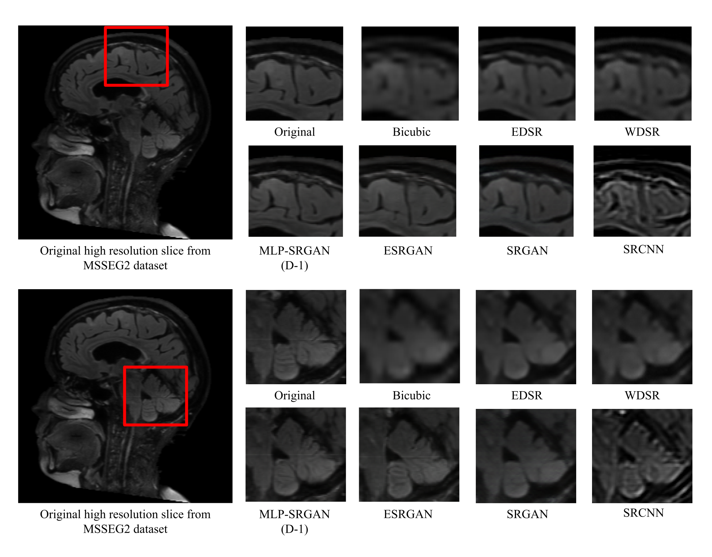

# MLP-SRGAN: A Single-Dimension Super Resolution GAN using MLP-Mixer

[](https://github.com/IAMLAB-Ryerson/MLP-SRGAN/issues)
[](https://github.com/IAMLAB-Ryerson/MLP-SRGAN/actions/workflows/pylint.yml)

## Contents
This repository contains:
* MLP-SRGAN PyTorch model
* MLP-SRGAN PyTorch training script
* MLP-SRGAN PyTorch data generator
* MLP-SRGAN PyTorch inference script
* No-reference image metrics

The MLP-SRGAN scripts are preconfigured to run MLP-SRGAN (D-1). To reconfigure the scripts to use MLP-SRGAN (D-3) or MLP-SRGAN (D-5) set n_residual_blocks in GeneratorMixer in model.py to either 3 or 5 respectively. The scripts as it stands is currently only compatible with 2D image formats or 3D .mat files.

## Dependencies
* Python 3
* Python packages: ```pip install numpy scikit-image scipy pywt pandas torch torchvision Pillow einops matplotlib```

## Pretrained Models
Pretrained models are available on Google Drive at the following link:
https://drive.google.com/drive/folders/1q4f1Yzraqtgdplw9dAtbdtWLGSm7vzHx?usp=sharing

## Model Diagrams


## Image Samples


## Training System Configuration
|  CPU | GPU | RAM |
| :---: | :---: | :---: |
|  AMD Threadripper 3990x | Nvidia RTX 3090 24 GB | 256 GB |
