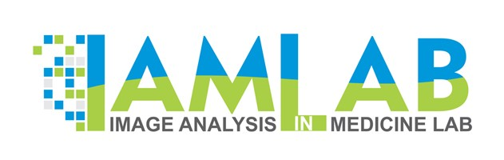
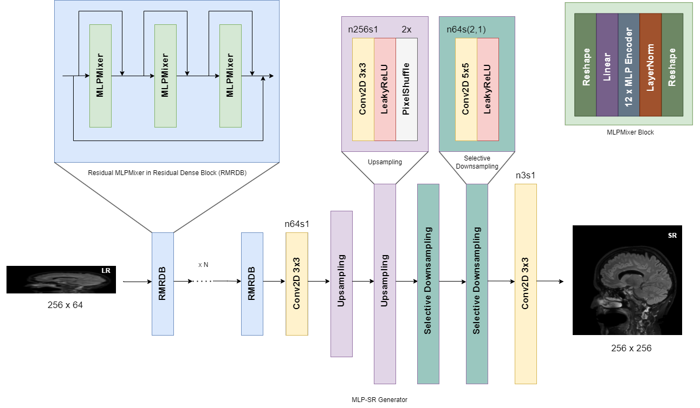
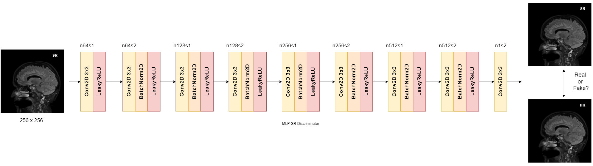
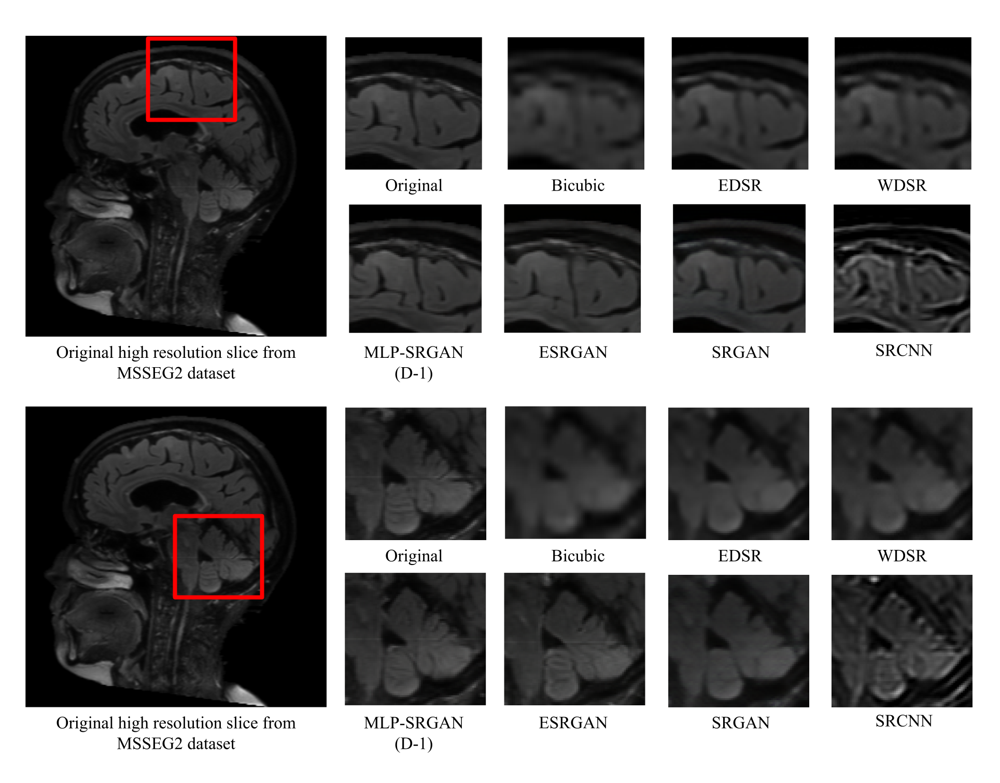

<p align="center"><a href="https://www.torontomu.ca/akhademi/">
  
</a></p>

# MLP-SRGAN: A Single-Dimension Super Resolution GAN using MLP-Mixer

[](https://github.com/IAMLAB-Ryerson/MLP-SRGAN/issues)   [](https://hub.docker.com/repository/docker/samirmitha/mlp-srgan/general) [](https://www.codido.co/marketplace/browse) [](https://arxiv.org/abs/2303.06298)

## Command Line Usage
Ideal input image size is 256 x 64, tiling will be used if images exceed these dimensions.

```console
Usage: python inference_mlpsrgan.py -n mlp-srgan-d-1 -i infile -o outfile [options]...

  -h                   show this help
  -i --input           Input image or folder | for 3D medical images use axial plane. Default: inputs
  -o --output          Output folder. Default: results
  -n --model_name      Model name. Default: mlp-srgan-d-1
  -s, --outscale       The final upsampling scale of the image (only 4 is available at the moment). Default: 4
  --suffix             Suffix of the restored image. Default: out
  -t, --tile           Tile size, 0 for no tile during testing. Default: 0
  --fp16               Use fp16 precision during inference. Default: fp32 (single precision).
  --ext                Image extension. Options: auto | jpg | png, auto means using the same extension as inputs. Default: auto
```

## CODIDO / Docker
### Building From Source
To build docker from source download the source code here and run the following docker build command:
```
docker build -t samirmitha/mlp-srgan:1.0.0 .
```

### Pulling Docker Image Directly
The docker image can be pulled directly from dockerhub using the following command:
```
docker pull samirmitha/mlp-srgan:1.0.0
```

### Running on CODIDO
The docker can also be run directly on [CODIDO](https://www.codido.co/marketplace/browse)!

## Pretrained Models
Pretrained models are available on Google Drive at the following link:
https://drive.google.com/drive/folders/1q4f1Yzraqtgdplw9dAtbdtWLGSm7vzHx?usp=sharing

## Model Diagrams



## Image Samples


## Contact
If you have any questions please email `samir.mitha@torontometu.ca`.

## License
[GPL v3.0](https://github.com/IAMLAB-Ryerson/MLP-SRGAN/blob/main/LICENSE)

## arXiv Paper
https://arxiv.org/abs/2303.06298

## Citation
```
@misc{mitha_choe_maralani_moody_khademi_2023, 
    title={MLP-SRGAN: A single-dimension super resolution gan using MLP-mixer}, 
    url={https://arxiv.org/abs/2303.06298}, 
    journal={arXiv.org}, 
    author={Mitha, Samir and Choe, Seungho and Maralani, Pejman Jahbedar and Moody, Alan R. and Khademi, April}, 
    year={2023}, 
    month={Mar}
}
```

## See Also
https://www.torontomu.ca/akhademi/

This repository uses the [PyTorch MLP-Mixer](https://github.com/lucidrains/mlp-mixer-pytorch).

This repository uses the format provided by [BasicSR](https://github.com/XPixelGroup/BasicSR). Please check out the repository!

This work is inspired by [Real-ESRGAN](https://github.com/xinntao/Real-ESRGAN) for natural images.
