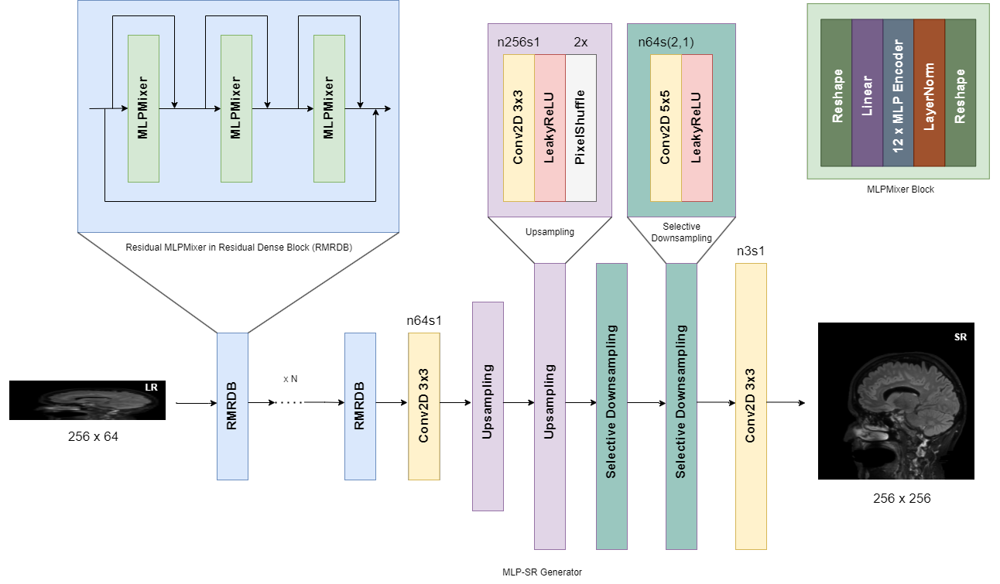
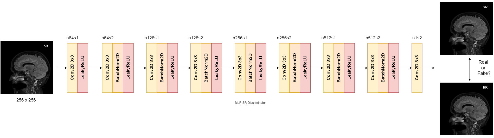

# MLP-SRGAN

## Contents
This repository contains:
* MLP-SRGAN PyTorch model
* MLP-SRGAN PyTorch training script
* MLP-SRGAN PyTorch data generator
* MLP-SRGAN PyTorch inference script
* No-reference image metrics

## Training System Configuration
|  CPU | GPU | RAM |
| :---: | :---: | :---: |
|  AMD Threadripper 3990x | Nvidia RTX 3090 24 GB | 256 GB |

## Model Diagrams

## License
[MIT](https://choosealicense.com/licenses/mit/)
